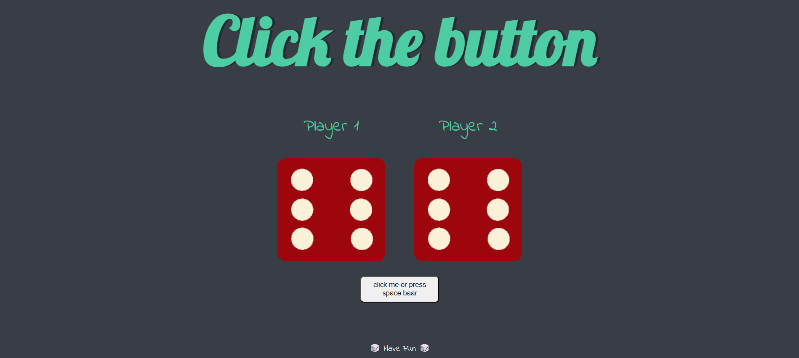

 <em></em>
# Dice Roll Game 🕹️

 (Click on the image to view this project)

## Overview:
This Dice Roll project is a simple web application built using HTML, CSS, and JavaScript. It simulates the rolling of a six-sided dice commonly used in various board games and tabletop activities. Users can click a button to roll the dice and see the result displayed on the screen.

## Features:
- **Dice Rolling:** Users can simulate rolling a six-sided dice by clicking a button or pressing space bar.
- **Random Number Generation:** The application generates a random number between 1 and 6 each time the dice is rolled.
- **Visual Feedback:** Upon rolling the dice, users can see the result displayed on the screen. 

## Technologies Used:
- **HTML:** Markup language used for structuring the web page elements.
- **CSS:** Stylesheets used for styling the visual presentation of the dice roll interface.
- **JavaScript:** Programming language used for implementing the interactive functionality of the dice roll, including random number generation and DOM manipulation. 

## Usage:
1. **Rolling the Dice:**
   - Click on the "Roll Dice" button or press space bar to simulate rolling the dice.
2. **Viewing the Result:**
   - The application displays the result of the dice roll on the screen.

## Learnings:
Through the Dice Roll project, I gained valuable insights into several key aspects of web development:
- **HTML Structure:** Crafting the layout and structure of the web page using HTML provided insights into organizing content and elements for better user experience.
- **CSS Styling:** Applying CSS styles to the project allowed me to enhance the visual presentation of the dice roll interface, exploring techniques for styling elements, layouts, and animations.
- **DOM Manipulation:** Experimenting with JavaScript allowed me to understand how to interact with the Document Object Model (DOM) to update the content of the web page dynamically.
- **Event Handling:** Implementing the functionality to roll the dice involved handling user events and triggering actions accordingly, enhancing my understanding of event-driven programming.
- **Random Number Generation:** Implementing the random number generation logic provided insights into generating random values within a specified range using JavaScript.
- **Responsive Design:** Crafting the user interface with CSS taught me principles of responsive design, ensuring the application adapts well to different screen sizes and devices.

## Contribution:
Contributions to the project are welcome! Feel free to fork the repository, make improvements, and submit pull requests to suggest new features or enhancements.

## License:
This project is open-source under the [MIT License](LICENSE), allowing for collaboration and distribution.
